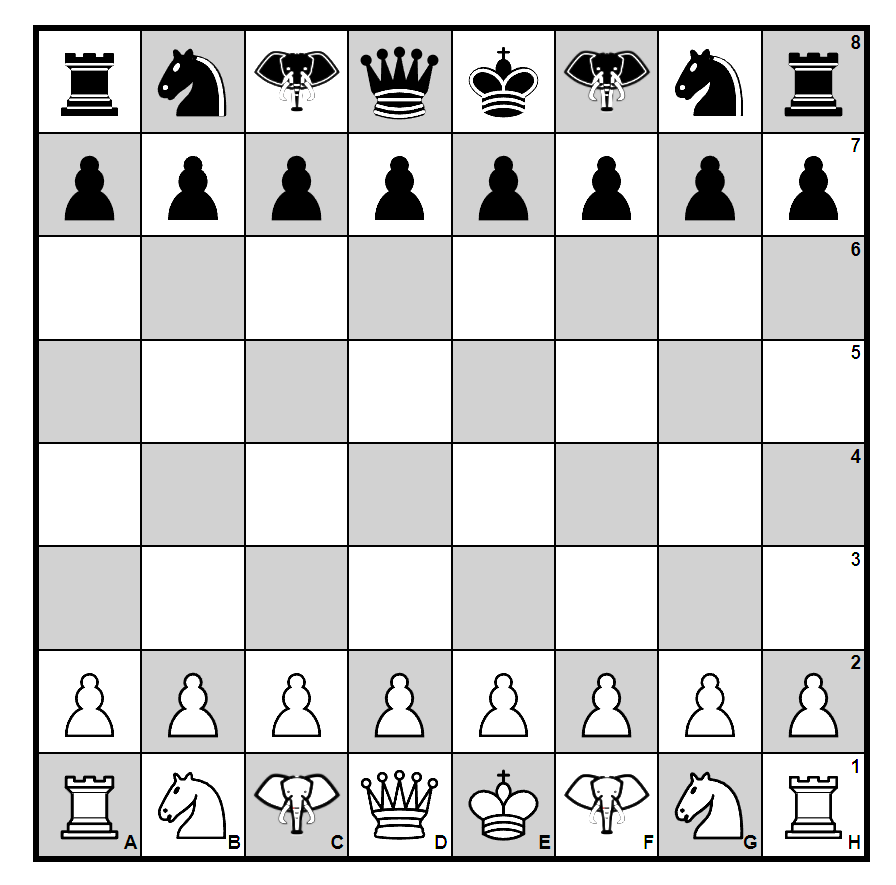

<h1>Unplayable ChessBoard's Read Me</h1>
    
## Description 
    
A chessboard generated on the page using JavaScript logic.

Last update => Pieces are generated on the board from :
https://commons.wikimedia.org/wiki/Category:SVG_chess_pieces

 

 

## Table of Contents
- [Installation](#installation)
- [Usage](#usage)
- [License](#license)
- [Contributing](#contributing)
- [Tests](#tests)
- [Questions](#questions)
    
## Installation
    
- Clone the repo to the working directory | `gh repo clone Valllerian/new-Chess-Board`;
- Enter working directory;
- Make sure lite-server is installed | `npm i lite-server`
- Run the code on lite-server | `npx lite-server`
    
## Usage 
    
No usage is available yet. 
    
## License
    

Copyright [2021] 

Permission is hereby granted, free of charge, to any person obtaining a copy of this software and associated documentation files (the "Software"), to deal in the Software without restriction, including without limitation the rights to use, copy, modify, merge, publish, distribute, sublicense, and/or sell copies of the Software, and to permit persons to whom the Software is furnished to do so, subject to the following conditions:

The above copyright notice and this permission notice shall be included in all copies or substantial portions of the Software.

THE SOFTWARE IS PROVIDED "AS IS", WITHOUT WARRANTY OF ANY KIND, EXPRESS OR IMPLIED, INCLUDING BUT NOT LIMITED TO THE WARRANTIES OF MERCHANTABILITY, FITNESS FOR A PARTICULAR PURPOSE AND NONINFRINGEMENT. IN NO EVENT SHALL THE AUTHORS OR COPYRIGHT HOLDERS BE LIABLE FOR ANY CLAIM, DAMAGES OR OTHER LIABILITY, WHETHER IN AN ACTION OF CONTRACT, TORT OR OTHERWISE, ARISING FROM, OUT OF OR IN CONNECTION WITH THE SOFTWARE OR THE USE OR OTHER DEALINGS IN THE SOFTWARE.

Find more information at https://opensource.org/licenses/MIT.
    
## Contributing
    
- Fork the repo at | `gh repo clone Valllerian/new-Chess-Board`;
- Create a working branch | `git checkout -b yourname-branch`;
- Commit any changes | `git commit -m 'Your changes here'`  *please, make sure to comment your commits*;
- Push your changes to the branch | `git push  yourname-branch`
- Submit a pull request;
- Cooperate on the pull request form if any questions/issues added;
    
## Tests
    
N\A
    
## Questions
    
- Feel free to add any issues and contact me at valeriibihun.co@gmail.com if you have any questions;

- Follow my code: https://github.com/valllerian;
    
